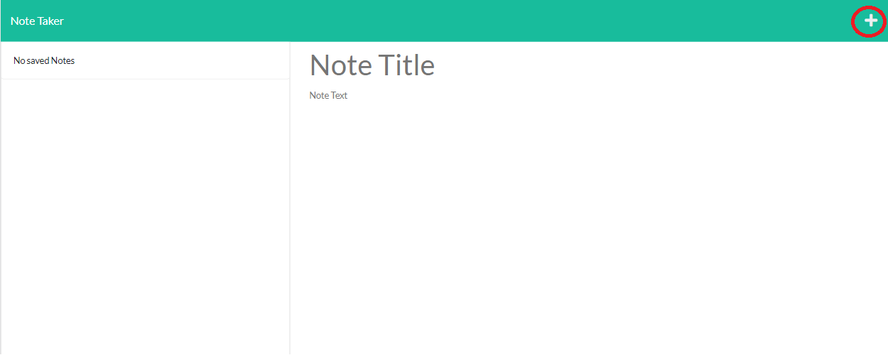
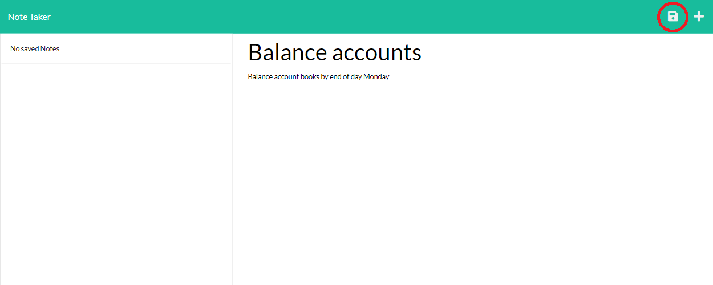
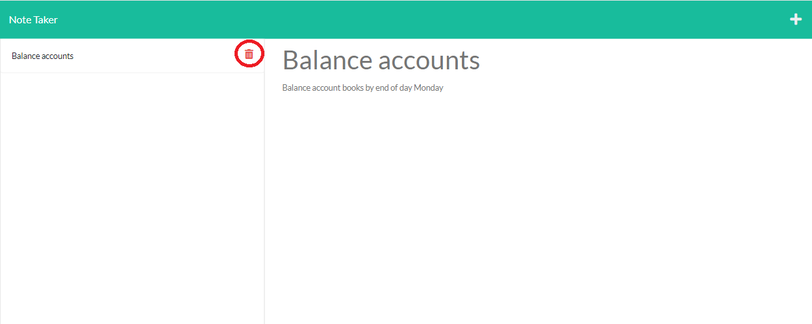

# Note-Taker            
## Description
a web application that can be used to write and save notes

## Table of Contents
* [Usage](#usage)
* [Screenshots](#screenshots) 
* [License](#license)
* [Contributing](#contributing)
* [Questions](#questions)
* [Link](#link)            
            
## Usage
Enter the title and text for your note then click the save icon to save it. You can access a saved note by clicking its title on the left side of the screen. If you want to delete a note, click the trash bin icon next to it.

## Screenshots

Click on the "+" icon to add a new note then enter the title and text.

Click on the save icon to save the note.

To access a saved note click on its title. To delete a note, click the trash bin icon beside it.

            
## License
Licensed under The MIT License
            
## Contributing
Front end provided by Nortwestern University Full Stack Flex

## Link
https://note-taker-ronarceo.herokuapp.com/
            
## Questions
Github: https://github.com/ronarceo

Email: ronaldmarceo@gmail.com